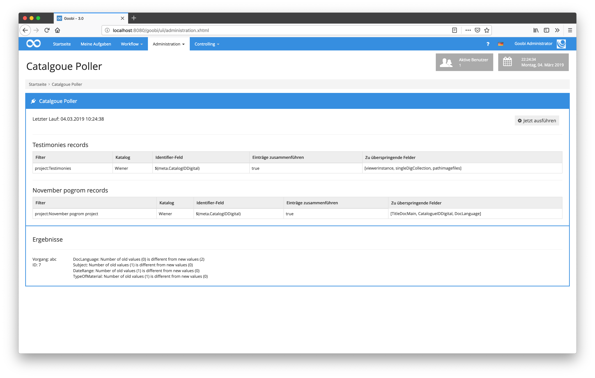
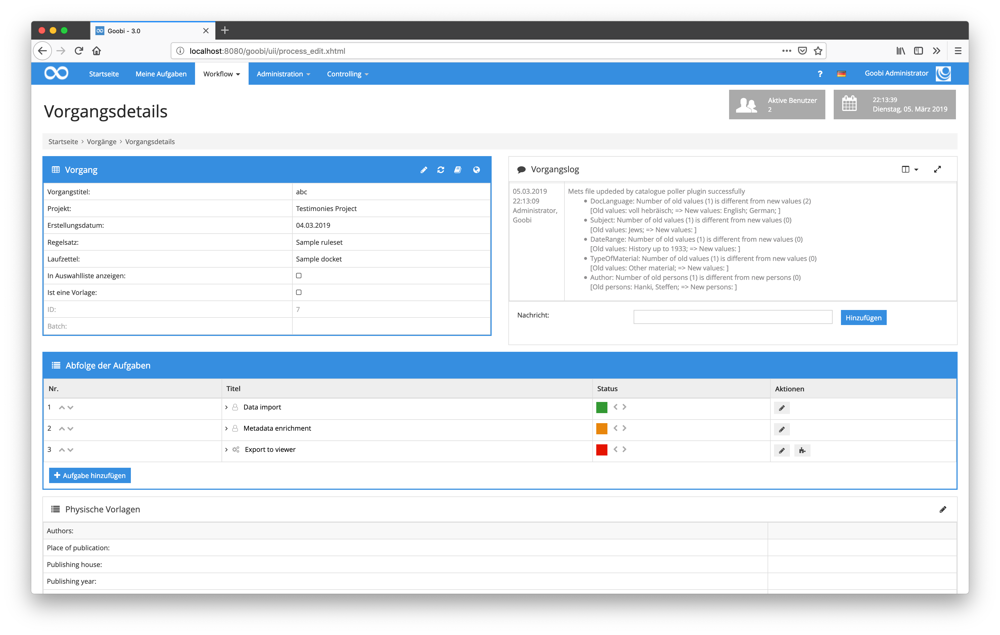

# Catalogue Poller

## Introduction

This documentation describes how to install, configure and use the Administration plugin to automatically repeat a catalog query to update records in Goobi workflow.

| Details | ​ |
| :--- | :--- |
| Version | 1.0.0 |
| Identifier | intranda\_administration\_catalogue\_poller |
| Source code | [https://github.com/intranda/goobi-plugin-administration-catalogue-poller](https://github.com/intranda/goobi-plugin-administration-catalogue-poller) |
| Licence | GPL 2.0 or newer |
| Compatibility | Goobi workflow 3.0.4 and newer |
| Documentation date | 05.03.2019 |

## Installation <a id="installation"></a>

The plugin consists of the following files to install:

```text
plugin_intranda_administration_catalogue-poller.jar
plugin_intranda_administration_catalogue-poller-GUI.jar
```

These files must be installed in the correct directories so that they are available in the following paths after the installation:

```text
/opt/digiverso/goobi/plugins/administration/plugin_intranda_administration_catalogue-poller.jar
/opt/digiverso/goobi/plugins/GUI/plugin_intranda_administration_catalogue-poller-GUI.jar
```

There is also a configuration file, which must be located at the following location:

```text
/opt/digiverso/goobi/config/plugin_intranda_administration_catalogue_poller.xml
```

## Configuration <a id="konfiguration"></a>

The plugin is configured via the configuration file `plugin_intranda_administration_catalogue_poller.xml` and can be adapted during operation. The following is an example configuration file:

> 
> ```markup
> <?xml version="1.0" encoding="UTF-8"?>
> <config_plugin>
>    
>    <!-- multiple different rules can be defined for individual use cases -->
>    <rule title="SampleProject">
>         
>         <!-- filter which items to run through (can be more then one, otherwise use *)
>         please notice that blanks inside of the filter query need to be surrounded by quotation marks -->
>         <filter>project:SampleProject</filter>
>         <filter>"project:Manuscript items"</filter>
>         
>         <!-- which catalogue to use (GBV, Wiener, CBL Adlib ...) -->
>         <catalogue>Wiener</catalogue>
>         
>         <!-- which identifier to use for the catalogue request (use
>         standard variable replacer compatible value here) -->
>         <catalogueIdentifier>$(meta.CatalogIDDigital)</catalogueIdentifier>
>         
>         <!-- define if existing structure subelements shall be kept (true),
>         otherwise a complete new mets file is created and overwrites the
>         existing one (false) -->
>         <mergeRecords>true</mergeRecords>
>         
>         <!-- execute an automatic export of updated records;
>         this is only executed if mergeRecords is set to true -->
>         <exportUpdatedRecords>false</exportUpdatedRecords>
>         
>         <!-- if records shall be merged: which existing fields shall not
>         be replace with new values? (use the metadatatypes from ruleset)-->
>         <skipField>viewerinstance</skipField>
>         <skipField>singleDigCollection</skipField>    
>         <skipField>pathimagefiles</skipField>
>         
>     </rule>
>    
>    <!-- internal timestamp for the plugin to know when it was last executed -->
>    <lastRun>1551731078691</lastRun>
> </config_plugin>
> ```
> 

| Parameter | Description |
| :--- | :--- |


| `rule title` | At this point, an internal name is specified, which is mainly used for the user interface to distinguish between the different rules |
| :--- | :--- |


| `filter` | The filter can be used to define one or more Goobi projects for which the rules defined here apply. With `*` the rule applies to all projects. Any spaces contained within the filter must be enclosed in quotation marks in the same way as within the Goobi interface. |
| :--- | :--- |


| `catalogue` | Here you can define which catalog is to be used for querying new data. This is the name of a catalog as it was defined within the global Goobi catalog configuration within `goobi_opac.xml`. |
| :--- | :--- |


| `catalogueIdentifier` | Definition of the metadata from the METS file to be used for the catalog query. Usually this is the same identifier that was used for the first catalog query and is usually stored within the metadata `${meta.CatalogIDDigital}`. |
| :--- | :--- |


| `exportUpdatedRecords` | If this value is set to `true`, the catalog query is followed by a new data export for all records that were actually updated during the catalog query. In this case, the data export is the step that was defined as the first export step within the workflow for the operation. This usually refers to the export and publication of the process within the Goobi viewers. It should be noted here that the processes are only exported if the mechanism for `mergeRecords` is also set to `false`. |
| :--- | :--- |


<table>
  <thead>
    <tr>
      <th style="text-align:left"><code>mergeRecords</code>
      </th>
      <th style="text-align:left">
        <p>If the value <code>true</code> is set, the existing METS file is updated
          with the current data from the catalog. Any additional metadata can be
          excluded from the update. The logical and physical structure tree within
          the METS file also remains unchanged.</p>
        <p>If the value is set to <code>false</code>, the existing METS file will
          be completely replaced by a new METS file generated by the catalog query.</p>
      </th>
    </tr>
  </thead>
  <tbody></tbody>
</table>

| `skipField` | Several metadata fields can be defined here, which should not be changed by a catalog query. This is particularly useful for those fields that do not come from a catalog query and were therefore previously entered in addition to the catalog data. Typical examples for such fields are `singleDigCollection`, `accesscondition` and `pathimagefiles`. Please note that this parameter is only used if the value for `mergeRecords` is `true`. |
| :--- | :--- |


The Catalogue Poller Plugin is automatically activated by Goobi. Its runtime starts at 22:00 and repeats itself every 24 hours.

If, in addition to this automatic process, a user also wants access to the plugin's user interface, he or she must belong to a user group that has been granted the following plugin-specific right to do so:

```text
Plugin_Goobi_CataloguePoller
```

In order to assign this right, the desired user group must first be assigned the right authorization in the right-hand area.


If the authorization for the user group is re-entered, the user must first log into Goobi again in order to be able to use this authorization level. The user can then click on the Catalogue Poller plugin in the Administration menu and manually trigger an update of the records at any time.



## Automatic backups

If the plugin finds updated metadata for a process and therefore updates the METS file, a backup of the current METS file `meta.xml` and, if relevant, the `meta_anchor.xml` is created automatically. The backup is saved next to the updated METS file.


## Logging within the process log

The updates of the metadata by the plugin usually take place fully automatically in the background. In order to be able to track what happened to a data record at any time, the events are logged. Detailed entries are automatically added to the process log for each process for which there were changes from this plugin. In addition to the timestamp, these entries also contain an exact list of the changed metadata fields and their contents. Thus, it is possible to trace the previous or the new value at any time.


