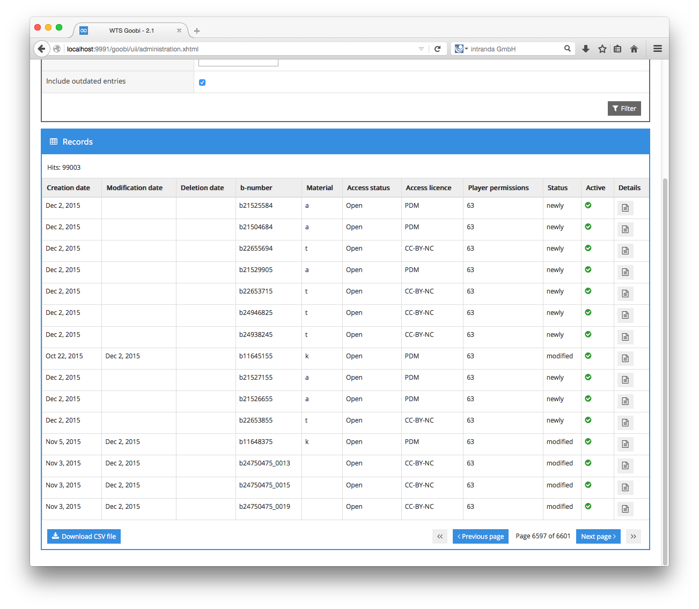
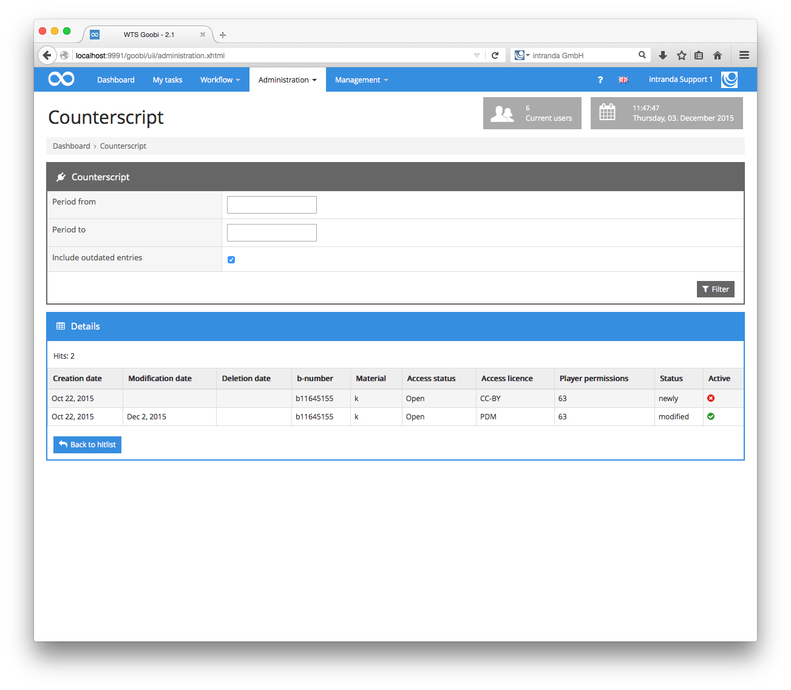

# Counterscript Application

## 1. Introduction

This document describes the installation, configuration and use of the new Counterscript application. The application is made up of two components, the Counterscript Application Server and the Goobi plugin Counterscript Client.

## 2.  Counterscript Application Server

The first part of the newly developed solution is the Counterscript Application Server, a standalone Java web application that needs to be installed on the existing Apache Tomcat server. The server data can be accessed using the RESTful API.

### 2.1. Overview

The application can be used to track changes made to METS files exported from Goobi. In order to do this, the network drive of the Wellcome Player containing the exported METS files is regularly scanned for new, modified or deleted METS files. Information from the files is then stored in a database.

This database can then be examined and the results delivered in `xml`, `csv` or `json` format. For each METS file, the following information is stored on the database:

> * Path and name of the file
> * b-number
> * material code
> * access status
> * access licence
> * access player permission
> * date of creation
> * date of modification
> * date of deletion
> * status of the file

### 2.2. Installation

The Counterscript Server Application should be installed using the following path:

```text
/var/lib/tomcat7/webapps/Counterscript.war
```

To ensure access to the application, it must also be enabled on the Apache web server. This is done in the file shown below:

```text
/etc/apache2/sites-enabled/000-default
```

You will need to insert the following configuration lines:

```markup
redirect /Counterscript http://pl-winslow/Counterscript/
<Location /Counterscript/>
     Order allow,deny
     Allow from all
     ProxyPass http://localhost:8080/Counterscript/ timeout=6000 retry=0
     ProxyPassReverse http://localhost:8080/Counterscript/
</Location>
```

Alongside the actual application, there is also a cronjob that launches a scheduled data update every day at 0:05. The cronjob is located at:

```text
/etc/cron.d/intranda-triggerCounterscript
```

### 2.3. Configuration

You will need to create a new MySQL database so that data from the Counterscript Application can be saved. This is done using the following SQL commands within an open SQL connection: create database counterscript;

```sql
create database counterscript;
GRANT ALL PRIVILEGES ON counterscript.* TO 'goobi'@'%' WITH GRANT OPTION;

CREATE TABLE `counterscript`.`files` (
    `id` int(10) unsigned NOT NULL AUTO_INCREMENT,
    `filename` varchar(255) DEFAULT NULL,
    `bnumber` varchar(255) DEFAULT NULL,
    `material` varchar(255) DEFAULT NULL,
    `access_status` varchar(255) DEFAULT NULL,
    `access_licence` varchar(255) DEFAULT NULL,
    `player_permission` varchar(255) DEFAULT NULL,
    `status` varchar(255) DEFAULT NULL,
    `creation_date` datetime DEFAULT NULL,
    `modification_date` datetime DEFAULT NULL,
    `deletion_date` datetime DEFAULT NULL,
    `current` boolean DEFAULT false,
    PRIMARY KEY (`id`)
    ) ENGINE = InnoDB DEFAULT CHARACTER SET = utf8;
```

You also need to identify this database on the Apache Tomcat in the file shown below:

```text
/var/lib/tomcat7/conf/context.xml
```

To do this, insert the following lines:

```markup
<Resource auth="Container"
driverClassName="org.mariadb.jdbc.Driver"
removeAbandoned="true"
logAbandoned="true"
maxActive="100"
maxIdle="30"
maxWait="10000"
name="counterscript"
password="PASSWORD"
type="javax.sql.DataSource"
url="jdbc:mariadb://localhost/counterscript?characterEncoding=UTF-8&amp;autoReconnect=true&amp;autoReconnectForPools=true"
username="goobi" />
```

No other settings are required in order to configure the Apache Tomcat.

### 2.4. Use

Once the Counterscript Application Server has been installed and configured, you can start using the RESTful API. Please note that the date used when accessing the API should always be written in the format `YYYY-MM-DD`.

The following calls are used to update the current store of data:

```text
wt-winnipeg/Counterscript/api/run
wt-winnipeg/Counterscript/api/run/{date}
```

If a URL is called without a date, the entire store of data is analysed. As this is very time-consuming, you can add a date to the URL in order to return only those changes made since the specified date.

In practice, however, neither instruction is necessary, since this task is performed automatically every day at 0:05 when the cronjob is called.

When an analysis of the stored data begins, the file system is scanned for new METS files. If a file is found with a more recent lastModifiedTime than on the previous scan, that file must be a new or modified file. If this is the case, the file is checked against the database to determine whether the b-number is already known. If it is unknown, the dataset is new; otherwise it is a modification. The required data are then read from the METS file using XPATH queries and written to the database. Next, the datasets from the individual folders are compared with the known datasets in the database. If a folder does not contain files which are still known in the database, that points to a deletion. This information is also added to the database.

The following calls can be used to search the database:

```text
wt-winnipeg/Counterscript/api/{format}
wt-winnipeg/Counterscript/api/{format}/withincative
wt-winnipeg/Counterscript/api/{format}/{start date}/{end date}
wt-winnipeg/Counterscript/api/{format}/withincative/{start date}/{end date}
```

The results can be generated in three different formats: `xml`, `csv` and `json`.

If only the format is specified, the API will deliver all the active entries stored on the database. If the parameter withincative is added to the URL, it will also return outdated entries.

If you want to narrow the search, you can specify a period by giving the start and end date. The set of results will then be restricted to datasets that have been modified in that period.

If you are looking for a single dataset, you can request the information using the following URL:

```text
wt-winnipeg/Counterscript/api/xml/bnumber/{number}
```

### 2.5.  Connection to external tools

The simplest way to connect external tools is via the RESTful API. To do this, you will need to implement the commands listed above in section 2.4. Alternatively, you can use a MySQL client, although in this case you should note that for security reasons the MySQL server can only be accessed from localhost.

The client can be launched using the following command on the Linux terminal:

```bash
mysql
```

You can then select the database counterscript:

```sql
use counterscript;
```

Here you can request all the tables:

```sql
show tables;
```

This will trigger the following response from the MySQL server:

|  Tables\_in\_counterscript  |
| :--- |
|  files                     |

The database has a files table with the following structure:

```sql
describe files;
```

The response from the database is shown below:

|  **Field**            |  **Type**            |  **Null** |  **Key**  |  **Default**  |  **Extra**  |
| :--- | :--- | :--- | :--- | :--- | :--- |
|  id                 |  int\(10\) unsigned  |  NO    |  PRI  |  NULL     |  auto\_increment  |
|  filename           |  varchar\(255\)      |  YES   |  |  NULL     |  |
|  bnumber            |  varchar\(255\)      |  YES   |  |  NULL     |  |
|  material           |  varchar\(255\)      |  YES   |  |  NULL     |  |
|  access\_status      |  varchar\(255\)      |  YES   |  |  NULL     |  |
|  access\_licence     |  varchar\(255\)      |  YES   |  |  NULL     |  |
|  player\_permission  |  varchar\(255\)      |  YES   |  |  NULL     |  |
|  status             |  varchar\(255\)      |  YES   |  |  NULL     |  |
|  creation\_date      |  datetime          |  YES   |  |  NULL     |  |
|  modification\_date  |  datetime          |  YES   |  |  NULL     |  |
|  deletion\_date      |  datetime          |  YES   |  |  NULL     |  |
|  current            |  tinyint\(1\)        |  YES   |  |  0        |  |

The contents of the table are:

```sql
select * from files;
```

A sample response from the database is given below:

| **id**     | **filename**    | **bnumber**      | **material**  | **access\_status**  | **access\_licence**  | **player\_permission**  | **status**   | **creation\_date**     | **modification\_date**    | **deletion\_date**        | **current**  |
| :--- | :--- | :--- | :--- | :--- | :--- | :--- | :--- | :--- | :--- | :--- | :--- |
|  97297  |  /mnt/export/7/4/7/6/b21286747\_2.xml  |  b21286747\_2  |  |  Open           |  PDM             |  63                 |  deleted   |  2015-09-24 14:51:57  |  NULL                 |  2015-11-26 00:16:54  |        1  |
|  98992  |  /mnt/export/9/6/7/5/b21355769.xml    |  b21355769    |  |  Open           |  CC-BY-NC        |  63                 |  modified  |  2015-08-18 22:21:33  |  2015-12-02 16:18:40  |  NULL                 |        1  |
|  99001  |  /mnt/export/x/4/9/4/b2265494x.xml    |  b2265494x    |  t         |  Open           |  CC-BY-NC        |  63                 |  newly     |  2015-12-02 17:34:48  |  NULL                 |  NULL                 |        1   |

### 2.6. Sample database queries

By way of example, we have prepared a number of SQL queries.

#### 2.6.1. Query 1: New records <a id="H2.6.1.Query1:Newrecords"></a>

Recently created \(‘New’\) open access records, selectable by date range:

```sql
select * from files where status = 'newly' and creation_date > '2015-11-01' and creation_date < '2015-12-01';
```

#### 2.6.2. Query 2: Modified records <a id="H2.6.2.Query2:Modifiedrecords"></a>

Amended records, selectable by date range, where Access conditions \(Status, Licence, and Player\) have been changed or deleted:

```sql
select bnumber, access_status, access_licence, player_permission from files where status = 'modified' and modification_date > '2015-11-01' and modification_date < '2015-12-01';
```

#### 2.6.3. Query 3: Deleted records <a id="H2.6.3.Query3:Deletedrecords"></a>

Deleted records, selectable by ‘Deleted date’ range:

```sql
select bnumber from files where status = 'deleted' and deletion_date > '2015-11-01' and deletion_date < '2015-12-01';
```

## 3. Goobi Counterscript Plugin

The second Counterscript development was designed as a Goobi administration plugin. This made it possible to use the existing user interface design and authentication.

### 3.1. Installation

The Goobi plugin is made up of three components:

```text
/opt/digiverso/goobi/plugins/administration/plugin_intranda_administration_Wellcome.jar
/opt/digiverso/goobi/plugins/GUI/plugin_intranda_administration_Wellcome-GUI.jar
/opt/digiverso/goobi/config/plugin_CounterscriptPlugin.xml
```

The first two files contain the program logic and the GUI. The file `plugin_CounterscriptPlugin.xml` is used to configure the RESTful URL, and the contents of the file are shown below:


```markup
<config_plugin>
    <rest_url>http://localhost:8080/Counterscript/api/</rest_url>
</config_plugin>
```


### 3.2. Use

Once the plugin has been installed and set up, it will be available to users in the drop-down `Administration` menu.


Once the GUI has loaded, you can select a start and end date or search the entire period. There is also an option to include outdated entries.


After filtering, the plugin will display a list of the datasets found for the specified period.



You can use the paginator function at the bottom of the window to navigate through the list, or you can save the entire set of hits as a CSV file. For each entry, you can also click the button in the Details column to track the history of that file and view every documented change.


