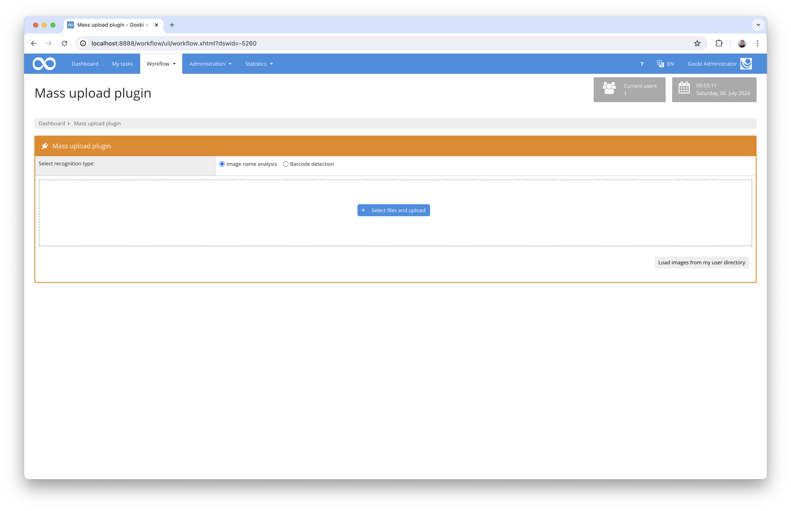

# Mass upload

## Introduction

This workflow plugin allows mass uploading of files that are to be automatically assigned to the correct processes by Goobi workflow. The plugin provides its own interface for this purpose, which either allows you to upload files directly via the web interface or, alternatively, can also read out images from the user directory. These images are checked by the plugin for their name in order to determine the associated Goobi process. If the process has been identified uniquely and the Goobi process identified is also in the configured workflow step, the images are assigned to this step and the workflow is processed further.

As well as assigning files on the basis of their file name, it is also possible to configure the system so that an image analysis is carried out instead, which reads barcodes. This makes it possible that images of several processes are named sequentially, for example, and only a separating sheet between the images needs to be included. All images after such a separator sheet with an identifiable barcode are assigned to the respective process until the next barcode in the file stack is determined.

## Overview

| Details |  |
| :--- | :--- |
| Version | 1.0.0 |
| Identifier | intranda\_workflow\_massupload |
| Source code | [https://github.com/intranda/goobi-plugin-workflow-massupload](https://github.com/intranda/goobi-plugin-workflow-massupload) |
| Licence | GPL 2.0 or newer |
| Compatibility | Goobi workflow 20.06 |
| Documentation date | 20.09.2020 |

## Installation

To install the plugin, the following two files must be installed:

```bash
/opt/digiverso/goobi/plugins/workflow/plugin_intranda_workflow_massupload.jar
/opt/digiverso/goobi/plugins/GUI/plugin_intranda_workflow_massupload-GUI.jar
```

To configure how the plugin should behave, various values can be adjusted in the configuration file. The configuration file is usually located here:

```bash
/opt/digiverso/goobi/config/plugin_intranda_workflow_massupload.xml
```

The contents of this configuration file are as follows:

```markup
<config_plugin>

    <!-- which file types shall be allowed for uploading these -->
    <allowed-file-extensions>/(\.|\/)(gif|jpe?g|png|tiff?|jp2|pdf)$/</allowed-file-extensions>

    <!-- name of the folder inside of a users home directory to use as alternative for web upload -->
    <user-folder-name>mass_upload</user-folder-name>

    <!-- define if instead of the file naming a barcode shall be analyzed to match the following images to the corresponding process until the next barcode
        gets recognized -->
    <use-barcodes>true</use-barcodes>

    <!-- copy images using goobi script in the background (true or false) -->
    <copy-images-using-goobiscript>false</copy-images-using-goobiscript>

    <!-- which workflow step has to be open to allow the upload into the process -->
    <allowed-step>Scanning</allowed-step>
    <allowed-step>Upload</allowed-step>

    <!-- which part of the files shall be used to find the right process (prefix, suffix or complete) -->
    <filename-part>prefix</filename-part>
    <filename-separator>_</filename-separator>

</config_plugin>
```

To use this plugin, the user must have the correct role authorisation.


Therefore please assign the role `Plugin_Goobi_Massupload` to the group.


## Explanation of the configuration options

The configuration of the plugin is as follows:

| Value | Description |
| :--- | :--- |
| `allowed-file-extensions` | This parameter defines which files may be uploaded. This is a regular expression. |
| `user-folder-name` | If the files are to be read from the user directory, you can specify here the name of the folder within the user directory from which the files are to be read. |
| `use-barcodes` | This parameter defines whether the assignment to the processes is to be based on barcodes or whether it is to be made on the basis of file names. |
| `copy-images-using-goobiscript` | If the data transfer is to take place in the background using the GoobiScript queue functionality, this can be specified here. |
| `allowed-step` | In this repeatable parameter, define which step in the determined process must currently be in the status `open`. |
| `filename-part` | This parameter can be used to specify how the file names are to be assigned to the processes. |
| `filename-separator` | Enter the separator character by which a prefix or suffix is to be cut off. Thus it can be determined that e.g. from a file `kleiuniv_987654321_00002.tif` with an filename-part by means of `prefix` and the filename-separator `_` a process is to be determined, which is called `kleinuniv_987654321`. |

## Operation of the plugin

If the plugin has been correctly installed and configured, it can be found within the menu item 'Workflow'.



At this point, files can either be uploaded or read from the user directory. Once the file names or images have been analysed, Goobi workflow shows the processes to which the imported images can be assigned.


With a click on the button `Import files into processes` the images are now moved to the directories of the detected processes and the workflow is continued.

Please note: If barcodes are to be recognised in order to determine the processes from them, it is important that the barcodes are also available in sufficient size and quality for the recognition to be successful.


